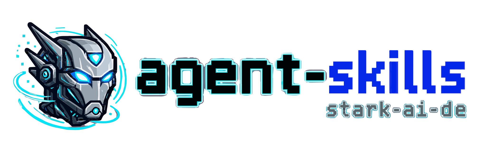

<p align="center">
  <picture>
    <source
      srcset="docs/assets/stark-ai-de-agent-skills-logo-static.svg"
      media="(prefers-reduced-motion: reduce)"
    />
    <source
      srcset="docs/assets/stark-ai-de-agent-skills-logo-animated.gif"
      type="image/gif"
    />
    
  </picture>
</p>

<h1 align="center">Agent Skills</h1>

<p align="center">
  Reviewed workflows for Codex, Cursor, Claude Code, and portable engineering tasks.
  <br />
  <a href="https://stark-ai-de.github.io/agent-skills/">Browse the catalog</a>
  ·
  <a href="https://chatgpt.com/plugins/plugins_6a85d98a7bc48191879aedd91610271e">
    
    
    Open the ChatGPT plugin
  </a>
  ·
  <a href="skills/README.md">Explore public skills</a>
  ·
  <a href="CONTRIBUTING.md">Contribute</a>
</p>

[](https://www.skills.sh/stark-ai-de/agent-skills)
[](https://github.com/stark-ai-de/agent-skills/releases)
[](https://github.com/stark-ai-de/agent-skills/actions/workflows/validate.yml)
[](https://github.com/stark-ai-de/agent-skills/actions/workflows/pages.yml)
[](LICENSE)

Public skills are reviewed before promotion. Draft and experimental workflows stay in the incubator until they have enough evaluation proof and a clear maintenance path.

## Quick start

List the public catalog without installing anything:

```bash
npx skills@latest add stark-ai-de/agent-skills --list
```

Install one skill into the agent detected for the current project:

```bash
npx skills@latest add stark-ai-de/agent-skills --skill architecture-compass
```

Update installed skills:

```bash
npx skills@latest update
```

<details>
<summary><strong>Install the Codex bundle</strong></summary>

```bash
npx skills@latest add stark-ai-de/agent-skills --skill codex-memory-curator codex-spec-interviewer animated-readme-logo architecture-compass codegraph-ast-grep drawio-diagrams -g -a codex -y
```

</details>

<details>
<summary><strong>Install the Cursor bundle</strong></summary>

```bash
npx skills@latest add stark-ai-de/agent-skills --skill cursor-memory-curator cursor-spec-interviewer animated-readme-logo architecture-compass codegraph-ast-grep drawio-diagrams -g -a cursor -y
```

</details>

<details>
<summary><strong>Install the Claude Code bundle</strong></summary>

```bash
npx skills@latest add stark-ai-de/agent-skills --skill claude-memory-curator claude-spec-interviewer animated-readme-logo architecture-compass codegraph-ast-grep drawio-diagrams -g -a claude-code -y
```

</details>

Bundles use explicit, version-controlled manifests. The Codex bundle is the ordered six-skill allowlist in [`plugins/stark-ai-developer.source.json`](plugins/stark-ai-developer.source.json), and its install command below is checked against that manifest. The bundles install globally; remove `-g` for a project-local install. Avoid `--skill '*'` when targeting one runtime because it also selects skills built specifically for other runtimes.

The `-a` option selects the host where a skill is installed; it does not change that skill's target contract. An intentionally cross-host install preserves target-specific evidence and output while adapting collaboration controls to the selected host.

## stark AI Developer plugin distributions

The repository's six-skill **stark AI Developer** bundle is explicit and
generated from [`plugins/stark-ai-developer.source.json`](plugins/stark-ai-developer.source.json):

- [`plugins/stark-ai-developer/`](plugins/stark-ai-developer/) is the portable
  Agent Plugins projection for compatible clients and direct local testing.
- `dist/openai/*.zip` is the OpenAI-native skills-only submission archive,
  generated from ephemeral adapter staging at package time.
- `dist/skills/*.zip` contains optional one-skill standalone archives.

Listing copy lives in [`docs/listing/openai/`](docs/listing/openai/) and is not bundle
membership or part of the adapter archive tree.
First-publication portal observations live in
[`docs/listing/openai/stark-ai-developer-first-publication.md`](docs/listing/openai/stark-ai-developer-first-publication.md).

[`plugins/stark-ai-developer.source.json`](plugins/stark-ai-developer.source.json)
holds membership and plugin identity. Catalog version stays in `package.json`.

The repository marketplace and any personal or workspace marketplace are local
testing/distribution catalogs. They do not, by themselves, prove submission,
approval, or public-directory publication. The public ChatGPT plugin page is
the shared ChatGPT/Codex catalog card. The package has no backend, MCP server,
connectors, authentication, telemetry, analytics, hidden network calls, or
runtime downloads.

These are separate installation routes:

- **ChatGPT plugin:** [chatgpt.com/plugins/plugins_6a85d98a7bc48191879aedd91610271e](https://chatgpt.com/plugins/plugins_6a85d98a7bc48191879aedd91610271e). Account, workspace, and plan eligibility still apply.
- **Repository/local plugin:** the portable projection through a compatible
  local or repository marketplace.
- **Standalone ChatGPT skill:** upload, share, or workspace-install an
  individual skill where the account and client support that route.
- **Standalone Codex or IDE skill:** install an individual skill through the
  supported Codex/IDE skill path or the standalone archive.
- **`npx skills`:** the existing canonical repository catalog and CLI
  installation path.

## Choose a skill

| When you need to…                                                    | Use                                                                                                                                                                                                                                                                    | Scope                |
| -------------------------------------------------------------------- | ---------------------------------------------------------------------------------------------------------------------------------------------------------------------------------------------------------------------------------------------------------------------- | -------------------- |
| Turn a fuzzy coding request into an implementation-ready spec        | [`codex-spec-interviewer`](skills/codex-operations/codex-spec-interviewer/SKILL.md), [`cursor-spec-interviewer`](skills/cursor-operations/cursor-spec-interviewer/SKILL.md), or [`claude-spec-interviewer`](skills/claude-operations/claude-spec-interviewer/SKILL.md) | Runtime-specific     |
| Review, plan, or clean persistent agent context                      | [`codex-memory-curator`](skills/codex-operations/codex-memory-curator/SKILL.md), [`cursor-memory-curator`](skills/cursor-operations/cursor-memory-curator/SKILL.md), or [`claude-memory-curator`](skills/claude-operations/claude-memory-curator/SKILL.md)             | Runtime-specific     |
| Set up or audit ADR governance and plan or run governed refactors    | [`architecture-compass`](skills/engineering-workflows/architecture-compass/SKILL.md)                                                                                                                                                                                   | Cross-runtime        |
| Set up, update, or diagnose CodeGraph and ast-grep for coding agents | [`codegraph-ast-grep`](skills/engineering-workflows/codegraph-ast-grep/SKILL.md)                                                                                                                                                                                       | Cross-runtime        |
| Create, edit, validate, or export an editable diagram                | [`drawio-diagrams`](skills/engineering-workflows/drawio-diagrams/SKILL.md)                                                                                                                                                                                             | Engineering workflow |
| Audit, create, transform, or animate a verified README logo pipeline | [`animated-readme-logo`](skills/engineering-workflows/animated-readme-logo/SKILL.md)                                                                                                                                                                                   | Engineering workflow |

See the [complete public catalog](skills/README.md) for exact trigger descriptions and [`skill-evals/`](skill-evals/README.md) for maintainer proof.

## How the catalog works

| Path                                       | Purpose                                               | Published?            |
| ------------------------------------------ | ----------------------------------------------------- | --------------------- |
| [`skills/`](skills/README.md)              | Reviewed skills discoverable through `npx skills`     | Yes                   |
| [`incubator/skills/`](incubator/README.md) | Candidate, experimental, or not-yet-public skills     | No                    |
| [`skill-evals/`](skill-evals/README.md)    | Activation cases, comparisons, and promotion evidence | Maintainer proof only |
| [`site/`](site/)                           | Astro source for the generated catalog                | GitHub Pages          |

Promotion is a folder move from `incubator/skills/<category>/<skill>/` to `skills/<category>/<skill>/`, backed by demonstrated value, activation tests, a reusable use case, manageable maintenance, and reviewable evaluation proof. See the [spec policy](docs/specs.md#documentation-updates) for public-contract updates.

## Development

```bash
pnpm install
```

Select checks from changed contracts and owning boundaries under [ADR-0041](docs/adrs/0041-select-validation-from-changed-contracts-and-owning-boundaries.short.md) ([Long, canonical](docs/adrs/0041-select-validation-from-changed-contracts-and-owning-boundaries.long.md) · [Guide](docs/adrs/0041-select-validation-from-changed-contracts-and-owning-boundaries.guide.md)). Run the local `npm run validate` aggregate for release intent or another mandatory gate; hosted Validate remains required for every pull request. OpenAI-native adapter packaging is proven with `npm run validate:openai-plugin` or hosted `validate:release-proof`, not by writing `adapters/`.

<details>
<summary><strong>Common maintainer commands</strong></summary>

| Command                                  | Purpose                                                        |
| ---------------------------------------- | -------------------------------------------------------------- |
| `npm run list`                           | List promoted public skills                                    |
| `npm run list:incubator`                 | List incubator skills                                          |
| `npm run validate`                       | Validate skills, ADRs, scripts, and repository contracts       |
| `npm run sync:agent-plugin`              | Regenerate `plugins/stark-ai-developer/` from canonical skills |
| `npm run validate:projections`           | Check the committed portable Agent Plugin projection           |
| `npm run validate:openai-plugin`         | Stage, validate, and discard the OpenAI-native adapter         |
| `npm run package:openai-plugin`          | Write `dist/openai/*.zip` from ephemeral adapter staging       |
| `npm run validate:archives`              | Build and inspect release archives                             |
| `npm run verify:release-reproducibility` | Compare two isolated deterministic builds                      |
| `npm run validate:release-proof`         | Archive, reproducibility, and endpoint release proof           |
| `npm run smoke:fingerprint`              | Fingerprint the exact clean-copy candidate set read-only       |
| `npm run smoke:install`                  | Test clean-copy discovery and exact host destinations          |
| `npx skills@latest add ./skills --list`  | Check local public skill discovery                             |
| `pnpm --filter ./site build`             | Build the generated catalog                                    |
| `pnpm format:check`                      | Check formatting                                               |
| `pnpm lint`                              | Lint repository scripts                                        |
| `node scripts/validate-release.mjs`      | Validate release readiness                                     |

Scaffold a skill only when its destination is clear:

```bash
npm run scaffold repo-maintenance/my-new-skill
npm run scaffold:incubator engineering-workflows/my-candidate-skill
```

</details>

## Documentation

| Topic                                | Reference                                                                   |
| ------------------------------------ | --------------------------------------------------------------------------- |
| Naming, safety, and review rules     | [Contributing](CONTRIBUTING.md)                                             |
| Validation and CI                    | [Validation](docs/validation.md)                                            |
| Publishing and release flow          | [Publishing](docs/publishing.md)                                            |
| Specs and durable decisions          | [Spec policy](docs/specs.md) · [ADR index](docs/adrs.md)                    |
| Domain language and boundaries       | [Glossary](CONTEXT.md) · [Out of scope](docs/out-of-scope/README.md)        |
| Logo animation and fallback behavior | [Motion specification](docs/assets/stark-ai-de-agent-skills-logo-motion.md) |

<details>
<summary><strong>Standards and upstream references</strong></summary>

- [Agent Skills specification](https://agentskills.io/specification)
- [Agent Skills evaluation guide](https://agentskills.io/skill-creation/evaluating-skills)
- [Agent Skills description optimization](https://agentskills.io/skill-creation/optimizing-descriptions)
- [Vercel skills CLI](https://github.com/vercel-labs/skills)

</details>

## Compatibility and safety

This repository follows the open Agent Skills specification. Individual compatibility varies by skill and host; read a skill's `SKILL.md` before installing it. Runtime-specific skills stay in their runtime category, while reusable workflows live under `engineering-workflows`.

Skills are executable context. Helper scripts are read-only unless their documentation explicitly says otherwise. Never add secrets, tokens, customer data, private repository paths, or internal hostnames to public skills, references, assets, tests, or examples.

## License

[Apache-2.0](LICENSE) for the skills and repository material published here.
