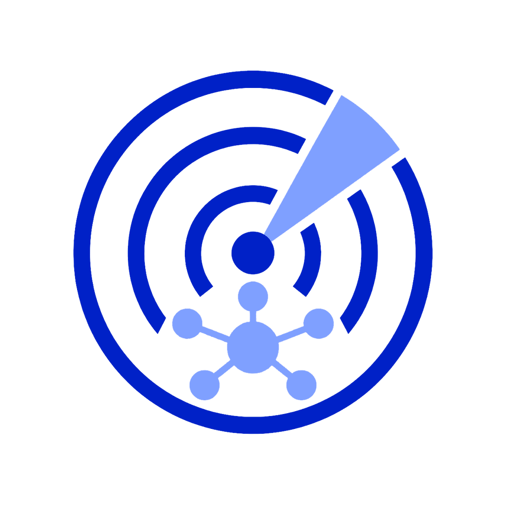
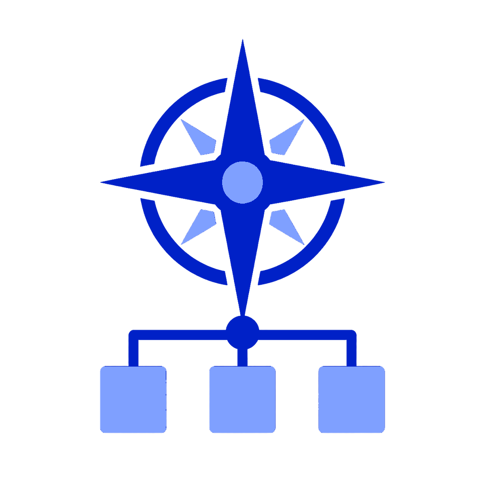
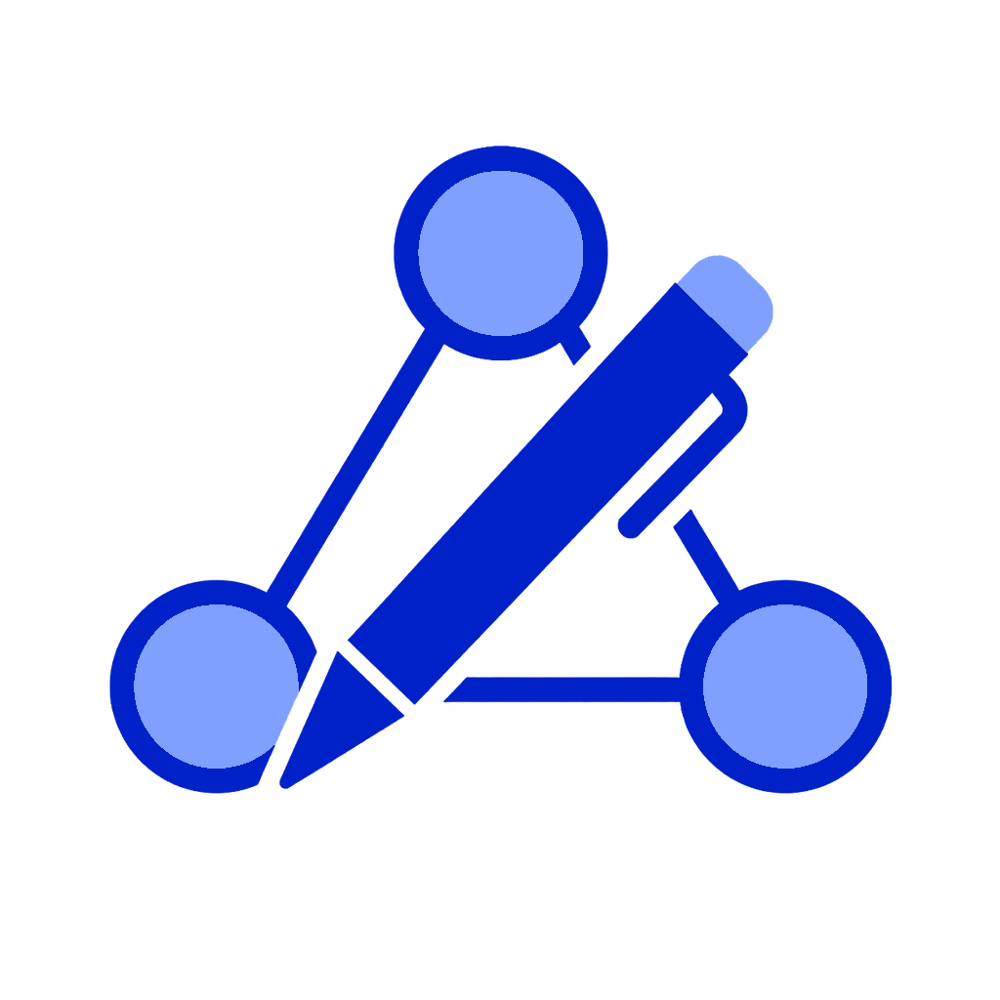

<p align="center">
  <picture>
    <source
      srcset="docs/assets/stark-ai-de-agent-skills-logo-static.svg"
      media="(prefers-reduced-motion: reduce)"
    />
    <source
      srcset="docs/assets/stark-ai-de-agent-skills-logo-animated.gif"
      type="image/gif"
    />
    
  </picture>
</p>

<h1 align="center">Agent Skills</h1>

<p align="center">
  Reviewed workflows for Codex, Cursor, Claude Code, and portable engineering tasks.
  <br />
  <a href="https://stark-ai-de.github.io/agent-skills/">Browse the catalog</a>
  ·
  <a href="https://chatgpt.com/plugins/plugins_6a85d98a7bc48191879aedd91610271e">
    Open the ChatGPT plugin
  </a>
  ·
  <a href="skills/README.md">Explore public skills</a>
  ·
  <a href="CONTRIBUTING.md">Contribute</a>
</p>

<p align="center">
  <a href="https://chatgpt.com/plugins/plugins_6a85d98a7bc48191879aedd91610271e">
    
  </a>
  <a href="https://www.skills.sh/stark-ai-de/agent-skills">
    
  </a>
</p>

<p align="center">
  <a href="https://github.com/stark-ai-de/agent-skills/releases">
    
  </a>
  <a href="https://github.com/stark-ai-de/agent-skills/actions/workflows/validate.yml">
    
  </a>
  <a href="https://github.com/stark-ai-de/agent-skills/actions/workflows/pages.yml">
    
  </a>
  <a href="LICENSE">
    
  </a>
</p>

Public skills are reviewed before promotion. Draft and experimental workflows stay in the incubator until they have enough evaluation proof and a clear maintenance path.

## Quick start

List the public catalog without installing anything:

```bash
npx skills@latest add stark-ai-de/agent-skills --list
```

Install one skill into the agent detected for the current project:

```bash
npx skills@latest add stark-ai-de/agent-skills --skill architecture-compass
```

Update installed skills:

```bash
npx skills@latest update
```

<details>
<summary><strong>Install the Codex bundle</strong></summary>

```bash
npx skills@latest add stark-ai-de/agent-skills --skill codex-memory-curator codex-spec-interviewer animated-readme-logo architecture-compass codegraph-ast-grep drawio-diagrams -g -a codex -y
```

Install the portable plugin with Codex CLI 0.147.0 or later:

```bash
codex plugin marketplace add stark-ai-de/agent-skills
codex plugin add stark-ai-developer@stark-ai-developer-local
```

See the [plugin documentation](plugins/README.md) for package and distribution details.

</details>

<details>
<summary><strong>Install the Cursor bundle</strong></summary>

```bash
npx skills@latest add stark-ai-de/agent-skills --skill cursor-memory-curator cursor-spec-interviewer animated-readme-logo architecture-compass codegraph-ast-grep drawio-diagrams -g -a cursor -y
```

</details>

<details>
<summary><strong>Install the Claude Code bundle</strong></summary>

```bash
npx skills@latest add stark-ai-de/agent-skills --skill claude-memory-curator claude-spec-interviewer animated-readme-logo architecture-compass codegraph-ast-grep drawio-diagrams -g -a claude-code -y
```

</details>

Bundles use explicit, version-controlled manifests. The Codex bundle is the ordered six-skill allowlist in [`plugins/stark-ai-developer.source.json`](plugins/stark-ai-developer.source.json), and its install command below is checked against that manifest. The bundles install globally; remove `-g` for a project-local install. Avoid `--skill '*'` when targeting one runtime because it also selects skills built specifically for other runtimes.

The `-a` option selects the host where a skill is installed; it does not change that skill's target contract. An intentionally cross-host install preserves target-specific evidence and output while adapting collaboration controls to the selected host.

## Choose a skill

|                                                            Icon                                                             | Skill                                                                              | When to use                                                                                                                                                                                                                                                                                                                                                                                                                                                                                                    |
| :-------------------------------------------------------------------------------------------------------------------------: | ---------------------------------------------------------------------------------- | -------------------------------------------------------------------------------------------------------------------------------------------------------------------------------------------------------------------------------------------------------------------------------------------------------------------------------------------------------------------------------------------------------------------------------------------------------------------------------------------------------------- |
|    | [Codex Memory Curator](skills/codex-operations/codex-memory-curator/SKILL.md)      | Audit, review, clean up, and prune Codex memories. Use when the user asks about `~/.codex/memories`, stale or noisy memories, memory pollution, cross-repo rule leakage, sensitive memory contents, memory config tuning, cleanup plans, or whether entries belong in memory, `AGENTS.md`, repo docs, skills, config, or deletion. Do not use for ordinary repo docs cleanup.                                                                                                                                  |
|  | [Codex Spec Interviewer](skills/codex-operations/codex-spec-interviewer/SKILL.md)  | Interview, source-challenge, verify, save, and ADR-gate fuzzy coding requests into Codex-ready implementation specs. Use when a feature, bugfix, refactor, migration, repo-wide change, or architecture task needs user-verified requirements, source-backed decisions, durable architecture decisions, acceptance criteria, validation commands, rollout notes, saved spec/ADR files, and a Codex execution prompt. Do not use when already fully specified or when the user wants direct implementation now. |
|    | [Animated README Logo](skills/engineering-workflows/animated-readme-logo/SKILL.md) | Audit, create, transform, or animate verified logo pipelines for GitHub READMEs. Use when a repository needs a new or reconstructed mark, motion specification, SVG animation master, executable animation recipe, static PNG, animated GIF, README-safe markup, reduced-motion fallback, or compatibility review. Do not use for unrelated app/site motion or generic image generation without a README branding target.                                                                                      |
|    | [Architecture Compass](skills/engineering-workflows/architecture-compass/SKILL.md) | Set up repository-native ADR governance, audit architecture, or plan and execute ADR-guided refactors through intent-bound workflows. Use when work needs binding agent-facing ADRs, provider-to-local mapping, architecture PR review or drift, Next.js request patterns, source placement, backend/runtime/env/config boundaries, stack deviations, or bounded ADR-governed implementation. Do not use for tiny edits, generic framework education, or work with no architecture or governance consequence.  |
|      | [CodeGraph + ast-grep](skills/engineering-workflows/codegraph-ast-grep/SKILL.md)   | Set up, update, or diagnose CodeGraph and ast-grep so coding agents can use semantic repository scope and structural syntax evidence automatically. Use when a repository needs an idempotent CodeGraph/ast-grep installation, stable tool and index migrations, MCP reconnection, persisted agent guidance, or a read-only setup diagnosis.                                                                                                                                                                   |
|         | [Draw.io Diagrams](skills/engineering-workflows/drawio-diagrams/SKILL.md)          | Create, draw, generate, edit, verify, and export draw.io/diagrams.net `.drawio` diagrams. Use when the user asks for editable diagrams, flowcharts, architecture, sequence, ER/UML/state, BPMN, SysML, ML/DL, swimlane, timeline, network, icon-rich technical diagrams, or PNG/SVG/PDF exports; do not use for charts/plots or artistic image generation.                                                                                                                                                     |

The icons follow the six glyph choices shown on the [stark AI Developer plugin page](https://chatgpt.com/plugins/plugins_6a85d98a7bc48191879aedd91610271e). See the [complete public catalog](skills/README.md) for Cursor- and Claude-specific variants, exact trigger descriptions, and [`skill-evals/`](skill-evals/README.md) for maintainer proof.

## How the catalog works

| Path                                       | Purpose                                               | Published?            |
| ------------------------------------------ | ----------------------------------------------------- | --------------------- |
| [`skills/`](skills/README.md)              | Reviewed skills discoverable through `npx skills`     | Yes                   |
| [`incubator/skills/`](incubator/README.md) | Candidate, experimental, or not-yet-public skills     | No                    |
| [`skill-evals/`](skill-evals/README.md)    | Activation cases, comparisons, and promotion evidence | Maintainer proof only |
| [`site/`](site/)                           | Astro source for the generated catalog                | GitHub Pages          |

Promotion is a folder move from `incubator/skills/<category>/<skill>/` to `skills/<category>/<skill>/`, backed by demonstrated value, activation tests, a reusable use case, manageable maintenance, and reviewable evaluation proof. See the [spec policy](docs/specs.md#documentation-updates) for public-contract updates.

## Development

```bash
pnpm install
```

Select checks from changed contracts and owning boundaries under [ADR-0041](docs/adrs/0041-select-validation-from-changed-contracts-and-owning-boundaries.short.md) ([Long, canonical](docs/adrs/0041-select-validation-from-changed-contracts-and-owning-boundaries.long.md) · [Guide](docs/adrs/0041-select-validation-from-changed-contracts-and-owning-boundaries.guide.md)). Run the local `pnpm run validate` aggregate for release intent or another mandatory gate; hosted Validate remains required for every pull request. OpenAI-native adapter packaging is proven with `pnpm run validate:openai-plugin` or hosted `validate:release-proof`, not by writing `adapters/`.

<details>
<summary><strong>Common maintainer commands</strong></summary>

| Command                                      | Purpose                                                        |
| -------------------------------------------- | -------------------------------------------------------------- |
| `pnpm run list`                              | List promoted public skills                                    |
| `pnpm run list:incubator`                    | List incubator skills                                          |
| `pnpm run validate`                          | Validate skills, ADRs, scripts, and repository contracts       |
| `pnpm run validate:runtime-matrix`           | Validate advisory runtime selections and fallbacks             |
| `pnpm run sync:agent-plugin`                 | Regenerate `plugins/stark-ai-developer/` from canonical skills |
| `pnpm run validate:projections`              | Check the committed portable Agent Plugin projection           |
| `pnpm run validate:openai-plugin`            | Stage, validate, and discard the OpenAI-native adapter         |
| `pnpm run package:openai-plugin`             | Write `dist/openai/*.zip` from ephemeral adapter staging       |
| `pnpm run validate:archives`                 | Build and inspect release archives                             |
| `pnpm run verify:release-reproducibility`    | Compare two isolated deterministic builds                      |
| `pnpm run build:release-subjects`            | Local fallback for the hosted final release subject artifact   |
| `pnpm run validate:release-proof`            | Archive, reproducibility, and endpoint release proof           |
| `pnpm run smoke:fingerprint`                 | Fingerprint the exact clean-copy candidate set read-only       |
| `pnpm run smoke:install`                     | Test clean-copy discovery and exact host destinations          |
| `pnpm dlx skills@1.5.23 add ./skills --list` | Check local public skill discovery                             |
| `pnpm --filter ./site run build`             | Build the generated catalog                                    |
| `pnpm run format:check`                      | Check formatting                                               |
| `pnpm run lint`                              | Lint repository scripts                                        |
| `pnpm run release:validate`                  | Validate release readiness                                     |

Scaffold a skill only when its destination is clear:

```bash
pnpm run scaffold repo-maintenance/my-new-skill
pnpm run scaffold:incubator engineering-workflows/my-candidate-skill
```

</details>

## Documentation

| Topic                                | Reference                                                                   |
| ------------------------------------ | --------------------------------------------------------------------------- |
| Naming, safety, and review rules     | [Contributing](CONTRIBUTING.md)                                             |
| Validation and CI                    | [Validation](docs/validation.md)                                            |
| Publishing and release flow          | [Publishing](docs/publishing.md)                                            |
| Specs and durable decisions          | [Spec policy](docs/specs.md) · [ADR index](docs/adrs.md)                    |
| Domain language and boundaries       | [Glossary](CONTEXT.md) · [Out of scope](docs/out-of-scope/README.md)        |
| Logo animation and fallback behavior | [Motion specification](docs/assets/stark-ai-de-agent-skills-logo-motion.md) |

<details>
<summary><strong>Standards and upstream references</strong></summary>

- [Agent Skills specification](https://agentskills.io/specification)
- [Agent Skills evaluation guide](https://agentskills.io/skill-creation/evaluating-skills)
- [Agent Skills description optimization](https://agentskills.io/skill-creation/optimizing-descriptions)
- [Vercel skills CLI](https://github.com/vercel-labs/skills)

</details>

## Compatibility and safety

Standalone skills follow the open [Agent Skills specification](https://agentskills.io/specification). The portable **stark AI Developer** plugin follows the [Agent Plugins](https://agent-plugins.org/) contract. Compatibility varies by skill, plugin client, and host; review a skill's `SKILL.md` and the installing client's plugin support before installation. Runtime-specific skills stay in their runtime category, while reusable workflows live under `engineering-workflows`.

Skills and plugins are executable context. Helper scripts are read-only unless their documentation explicitly says otherwise. Never add secrets, tokens, customer data, private repository paths, or internal hostnames to public skills, plugins, references, assets, tests, or examples.

## License

[Apache-2.0](LICENSE) for the skills and repository material published here.
