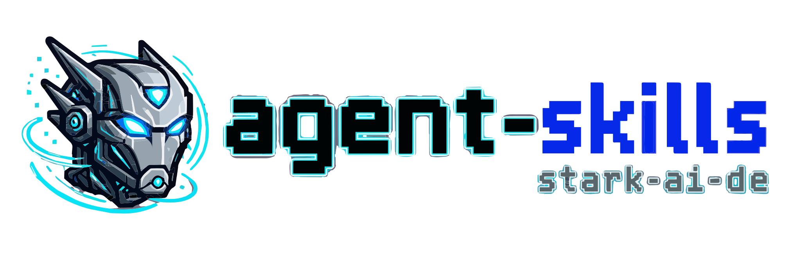

<p align="center">
  
</p>

# Agent Skills

[](https://www.skills.sh/stark-ai-de/agent-skills)
[](https://github.com/stark-ai-de/agent-skills/releases)
[](https://github.com/stark-ai-de/agent-skills/actions/workflows/validate.yml)
[](https://github.com/stark-ai-de/agent-skills/actions/workflows/pages.yml)
[](LICENSE)

Public Agent Skills for Codex operations, Cursor operations, Claude operations, repo maintenance, skill maintenance, productivity, and engineering workflows.

Skills in this repository are reviewed before they are added to the public catalog. Draft and experimental skills live in the incubator until they have enough evaluation proof and maintenance clarity.

Browse the generated GitHub Pages catalog at <https://stark-ai-de.github.io/agent-skills/>.

## Install

Check available public skills:

```bash
npx skills@latest add stark-ai-de/agent-skills --list
```

This only lists skills; it does not install them or create a skills.sh install event.

Install all Cursor-ready public skills globally for Cursor:

```bash
npx skills@latest add stark-ai-de/agent-skills --skill cursor-spec-interviewer cursor-memory-curator codegraph-ast-grep -g -a cursor -y
```

Install the Cursor-native spec interviewer project-locally for Cursor:

```bash
npx skills@latest add stark-ai-de/agent-skills --skill cursor-spec-interviewer -a cursor
```

Install the Cursor-native memory curator project-locally for Cursor:

```bash
npx skills@latest add stark-ai-de/agent-skills --skill cursor-memory-curator -a cursor
```

Install the Claude Code public skills from a repository clone into project-local Claude skills:

```bash
mkdir -p .claude/skills
cp -R skills/claude-operations/claude-spec-interviewer .claude/skills/
cp -R skills/claude-operations/claude-memory-curator .claude/skills/
```

Install them user-wide for Claude Code:

```bash
mkdir -p ~/.claude/skills
cp -R skills/claude-operations/claude-spec-interviewer ~/.claude/skills/
cp -R skills/claude-operations/claude-memory-curator ~/.claude/skills/
```

Install all Codex-ready public skills globally for Codex:

```bash
npx skills@latest add stark-ai-de/agent-skills --skill codegraph-ast-grep codex-spec-interviewer codex-memory-curator architecture-compass drawio-diagrams -g -a codex -y
```

Avoid `--skill '*'` for a single runtime: the wildcard selects every public skill, so it would also install Cursor- and Claude-specific skills such as `cursor-spec-interviewer`, `cursor-memory-curator`, and `claude-spec-interviewer` into Codex.

Install a promoted public skill for Codex:

```bash
npx skills@latest add stark-ai-de/agent-skills --skill codegraph-ast-grep -g -a codex
npx skills@latest add stark-ai-de/agent-skills --skill codex-spec-interviewer -g -a codex
npx skills@latest add stark-ai-de/agent-skills --skill codex-memory-curator -g -a codex
npx skills@latest add stark-ai-de/agent-skills --skill architecture-compass -g -a codex
npx skills@latest add stark-ai-de/agent-skills --skill drawio-diagrams -g -a codex
```

Use `codegraph-ast-grep` when a repo needs CodeGraph plus ast-grep setup, runtime-specific MCP guidance, exploration, structural search, or refactor planning:

```text
Use $codegraph-ast-grep to set up CodeGraph with ast-grep and use it for repo exploration or safe refactor planning.
```

Typical use cases:

- explain how a validation, build, route, or feature flow works before editing it,
- find callers, callees, and likely impact before changing a shared function,
- trace how one symbol or request path reaches another,
- find exact code shapes such as unsafe writes, repeated handlers, or deprecated API calls,
- combine semantic scope from CodeGraph with syntax-exact ast-grep matches for small refactors.

Install the same portable skill for Cursor when a Cursor project needs CodeGraph plus ast-grep guidance:

```bash
npx skills@latest add stark-ai-de/agent-skills --skill codegraph-ast-grep -g -a cursor -y
```

Use `codex-spec-interviewer` when a coding request is still fuzzy:

```text
/plan Use $codex-spec-interviewer to turn this refactor idea into a Codex-ready implementation spec with acceptance criteria, validation commands, and an ADR gate result.
```

Use `codex-memory-curator` when Codex memory state needs review or cleanup:

```text
Use $codex-memory-curator to audit my Codex memories for stale repo rules, sensitive entries, and cleanup candidates.
```

Use `cursor-spec-interviewer` when a Cursor Agent coding request is still fuzzy:

```text
Switch to Plan Mode, then use /cursor-spec-interviewer to turn this Cursor refactor idea into a Cursor-ready implementation spec with acceptance criteria, validation commands, and an ADR gate result.
```

Use `cursor-memory-curator` when Cursor durable context needs review or cleanup:

```text
Use $cursor-memory-curator to audit my Cursor rules, stale persistent context, and cleanup candidates.
```

Use `claude-spec-interviewer` when a Claude Code coding request is still fuzzy:

```text
/claude-spec-interviewer Turn this Claude Code refactor idea into a persisted implementation spec with acceptance criteria, validation commands, and an ADR gate result; enter native Plan mode first when the host tool is available.
```

Use `claude-memory-curator` when Claude Code durable context needs review or cleanup:

```text
Use $claude-memory-curator to audit my CLAUDE.md files, Claude rules, auto memory, stale instructions, and cleanup candidates.
```

Use `architecture-compass` when a repository needs ADR guardrails or ADR-guided refactoring:

```text
Use $architecture-compass in setup mode to install ADR guardrails, or refactor mode to align code with repo ADRs, stack rules, and examples.
```

Use `drawio-diagrams` when a task needs editable draw.io / diagrams.net output:

```text
Use $drawio-diagrams to create, edit, verify, or export an editable .drawio architecture diagram.
```

## Public Catalog

The public catalog lives under [`skills/`](skills/README.md). Candidate, experimental, personal, private, or third-party helper skills do not belong in this tree.

| Skill                                                                                  | Use when                                                                                                                                                           | Proof                                                                                   |
| -------------------------------------------------------------------------------------- | ------------------------------------------------------------------------------------------------------------------------------------------------------------------ | --------------------------------------------------------------------------------------- |
| [`architecture-compass`](skills/engineering-workflows/architecture-compass/SKILL.md)   | A repository needs ADR governance setup, or code/diffs/new implementation must follow ADRs, stack rules, source structure, and runtime boundaries.                 | [`skill-evals/architecture-compass/`](skill-evals/architecture-compass/README.md)       |
| [`claude-memory-curator`](skills/claude-operations/claude-memory-curator/SKILL.md)     | Claude Code durable context is stale, noisy, conflicting, sensitive, misplaced, unenforced, or needs review, cleanup plans, or destination classification.         | [`skill-evals/claude-memory-curator/`](skill-evals/claude-memory-curator/README.md)     |
| [`claude-spec-interviewer`](skills/claude-operations/claude-spec-interviewer/SKILL.md) | The user asks for a spec, implementation plan, PRD, or plan before coding, and a fuzzy Claude Code task needs a persisted Claude-ready spec first.                 | [`skill-evals/claude-spec-interviewer/`](skill-evals/claude-spec-interviewer/README.md) |
| [`codegraph-ast-grep`](skills/engineering-workflows/codegraph-ast-grep/SKILL.md)       | CodeGraph and ast-grep need setup, runtime-specific MCP guidance, repo exploration, structural search, impact analysis, or safe refactor planning.                 | [`skill-evals/codegraph-ast-grep/`](skill-evals/codegraph-ast-grep/README.md)           |
| [`codex-memory-curator`](skills/codex-operations/codex-memory-curator/SKILL.md)        | Codex memory state is stale, noisy, repo-specific, sensitive, conflicting, or needs review, cleanup plans, destination classification, or config tuning.           | [`skill-evals/codex-memory-curator/`](skill-evals/codex-memory-curator/README.md)       |
| [`codex-spec-interviewer`](skills/codex-operations/codex-spec-interviewer/SKILL.md)    | The user asks for a spec, implementation plan, PRD, or plan before coding, and a fuzzy Codex task needs a user-verified, persisted Codex-ready spec first.         | [`skill-evals/codex-spec-interviewer/`](skill-evals/codex-spec-interviewer/README.md)   |
| [`cursor-memory-curator`](skills/cursor-operations/cursor-memory-curator/SKILL.md)     | Cursor durable context is stale, noisy, ignored, sensitive, conflicting, or needs review, cleanup plans, destination classification, or settings action guidance.  | [`skill-evals/cursor-memory-curator/`](skill-evals/cursor-memory-curator/README.md)     |
| [`cursor-spec-interviewer`](skills/cursor-operations/cursor-spec-interviewer/SKILL.md) | The user asks for a spec, implementation plan, PRD, or plan before coding, and a fuzzy Cursor Agent task needs a user-verified, persisted Cursor-ready spec first. | [`skill-evals/cursor-spec-interviewer/`](skill-evals/cursor-spec-interviewer/README.md) |
| [`drawio-diagrams`](skills/engineering-workflows/drawio-diagrams/SKILL.md)             | Editable draw.io / diagrams.net diagrams need to be created, edited, verified, repaired, or exported as `.drawio`, PNG, SVG, or PDF.                               | [`skill-evals/drawio-diagrams/`](skill-evals/drawio-diagrams/README.md)                 |

## Repository Layout

- [`skills/`](skills/README.md) - promoted public skills installable through `npx skills`.
- [`incubator/skills/`](incubator/README.md) - candidate skills with `metadata.internal: true`; not public catalog entries.
- [`skill-evals/`](skill-evals/README.md) - maintainer proof for promotion decisions, kept outside runtime skill payloads.
- [`docs/specs/`](docs/specs/README.md) - publishable implementation specs; private, exploratory, sensitive, or not-yet-public specs belong in ignored `do-not-publish/`.
- [`docs/specs.md`](docs/specs.md) - repository policy for persisted implementation specs.
- [`docs/adrs/`](docs/adrs/README.md) - short decision record files for repo-level policy.
- [`docs/adrs.md`](docs/adrs.md) - ADR policy and index.
- [`site/`](site/) - Astro static GitHub Pages site generated from public and incubator `SKILL.md` files.
- `.agents/skills/` - ignored maintainer-local helper installs; not part of this catalog.
- `.claude/skills/` - optional ignored Claude Code project-local installs; not part of this catalog.

## Specs and ADRs

See [`docs/specs.md`](docs/specs.md) for spec persistence, filename examples, ADR linkage, and repo-facing documentation update rules. See [`docs/adrs.md`](docs/adrs.md) for ADR policy and the index.

<details>
<summary>Incubator map</summary>

| Problem                                     | Candidate skills                                                                                                                                                                       |
| ------------------------------------------- | -------------------------------------------------------------------------------------------------------------------------------------------------------------------------------------- |
| Agent loses context                         | [`codex-context-guard`](incubator/skills/codex-operations/codex-context-guard/SKILL.md), [`handoff`](incubator/skills/productivity/handoff/SKILL.md)                                   |
| Repo maintenance is unclear                 | [`repo-health-audit`](incubator/skills/repo-maintenance/repo-health-audit/SKILL.md)                                                                                                    |
| Pull request review is too shallow          | [`pr-review`](incubator/skills/repo-maintenance/pr-review/SKILL.md)                                                                                                                    |
| Issues are messy                            | [`issue-triage`](incubator/skills/repo-maintenance/issue-triage/SKILL.md)                                                                                                              |
| Skill quality or installability is drifting | [`skill-repo-curator`](incubator/skills/skill-maintenance/skill-repo-curator/SKILL.md), [`skill-authoring-review`](incubator/skills/skill-maintenance/skill-authoring-review/SKILL.md) |

</details>

## Promotion Model

Promotion is a folder move from `incubator/skills/<category>/<skill>/` to `skills/<category>/<skill>/`.

Before promotion, a skill needs:

- evidence that it improves work quality,
- activation tests for when it should and should not trigger,
- a general or high-value use case,
- manageable maintenance cost,
- reviewable proof under `skill-evals/<skill>/`.

For promotion and public-contract documentation updates, see [`docs/specs.md`](docs/specs.md#documentation-updates).

## Development

Install dependencies:

```bash
pnpm install
```

Common commands:

| Command                                 | Purpose                                                             |
| --------------------------------------- | ------------------------------------------------------------------- |
| `npm run list`                          | List promoted public skills.                                        |
| `npm run list:incubator`                | List incubator skills.                                              |
| `npm run validate`                      | Validate skills, ADRs, scripts, and repository contracts.           |
| `npm run smoke:install`                 | Test public install discovery from a clean copy without `.agents/`. |
| `npx skills@latest add ./skills --list` | Check local public skill discovery.                                 |
| `pnpm --filter ./site build`            | Build the generated GitHub Pages catalog.                           |
| `pnpm format:check`                     | Check formatting.                                                   |
| `pnpm lint`                             | Lint scripts.                                                       |
| `node scripts/validate-release.mjs`     | Validate release readiness from `package.json`.                     |
| `node scripts/print-release-notes.mjs`  | Print release notes from `CHANGELOG.md`.                            |

Scaffold a promoted skill only when promotion proof is ready:

```bash
npm run scaffold repo-maintenance/my-new-skill
```

Scaffold an incubator skill:

```bash
npm run scaffold:incubator engineering-workflows/my-candidate-skill
```

## Maintainer Docs

- [Domain glossary](CONTEXT.md)
- [Validation](docs/validation.md)
- [Publishing](docs/publishing.md)
- [Skill examples](docs/examples/README.md)
- [Out-of-scope boundaries](docs/out-of-scope/README.md)
- [Decision records](docs/adrs.md)

## Relevant Sources

- [Agent Skills specification](https://agentskills.io/specification) - canonical `SKILL.md` format, frontmatter constraints, optional `scripts/`, `references/`, and `assets/`, progressive disclosure, and validation.
- [Agent Skills evaluation guide](https://agentskills.io/skill-creation/evaluating-skills) - upstream guidance for skill eval cases, with-skill versus baseline runs, assertions, grading evidence, timing, and benchmark summaries.
- [Agent Skills description optimization](https://agentskills.io/skill-creation/optimizing-descriptions) - upstream guidance for trigger eval queries, positive and negative cases, repeated runs, and train/validation splits.
- [Agent Skills client implementation guide](https://agentskills.io/client-implementation/adding-skills-support) - discovery, activation, `.agents/skills/` conventions, and progressive disclosure behavior across clients.
- [Vercel Agent Skills docs](https://vercel.com/docs/agent-resources/skills) - `npx skills` installation flow and public skill discovery.
- [Vercel skills CLI README](https://github.com/vercel-labs/skills/blob/main/README.md) - CLI source formats and `metadata.internal: true` behavior for hiding work-in-progress skills from normal discovery.
- [OpenAI agent evals guide](https://developers.openai.com/api/docs/guides/agent-evals) and [OpenAI evaluation best practices](https://developers.openai.com/api/docs/guides/evaluation-best-practices) - broader guidance for traces, graders, datasets, repeatable eval runs, and continuous evaluation.
- [Anthropic evaluation guidance](https://platform.claude.com/docs/en/test-and-evaluate/develop-tests) - broader guidance for success criteria, task-specific evals, edge cases, and grading methods.

## Compatibility

This repo follows the open Agent Skills specification:

https://agentskills.io/specification

Each skill is a directory with a required `SKILL.md` file containing `name` and `description` frontmatter, plus optional `references/`, `scripts/`, and `assets/`.

Codex CLI is the primary runtime, but the skills are kept portable for Vercel skills CLI, Claude Code, Cursor, GitHub Copilot agent environments where compatible, and other agents that support the open Agent Skills format. Claude-specific plugin metadata is intentionally omitted until an ADR makes it a supported publishing surface.

Public skill helper scripts prefer dependency-free Node.js `.mjs` files for macOS, Linux, Windows, WSL, and CI portability. See [ADR-0014](docs/adrs/0014-prefer-node-skill-helper-scripts.md).

## Safety

Skills are executable context. Review any skill before installing it into an agent runtime.

This repository avoids destructive scripts in v1. Helper scripts are read-only unless their own documentation explicitly says otherwise. Do not add secrets, tokens, customer data, private repo paths, or internal hostnames to skills, references, assets, tests, or examples.

## Contributing

See [CONTRIBUTING.md](CONTRIBUTING.md) for naming, frontmatter, safety, validation, and review rules. Every skill must keep `SKILL.md` concise and move long rubrics, examples, and templates into `references/` or `assets/`.

## License

Apache-2.0 for the skills and repository material published from this repo.
