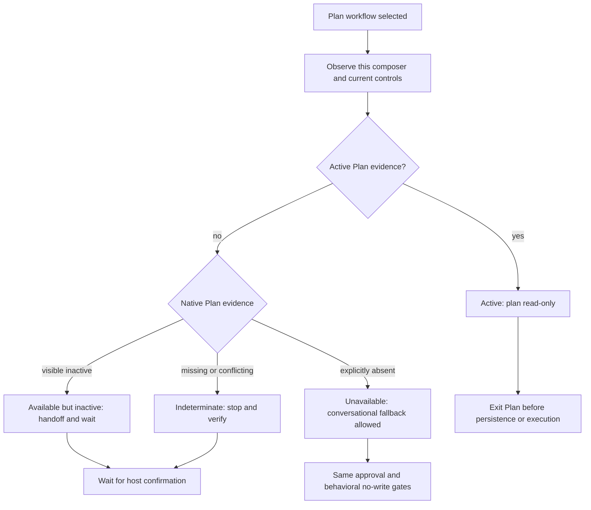

# ChatGPT host Plan-mode adapter

## Goal

Make the portable ChatGPT-facing slice of the stark AI Developer plugin observe
the current composer and collaboration controls before classifying Plan mode.
The four CHAT+CODEX skills must use a native Plan control when this turn proves
one is available, use a conversational fallback only after this turn proves
native planning unavailable or the user explicitly declines it, and stop when
the host surface or capability evidence is indeterminate. Starter prompts must
remain useful after a skill is already selected and must not embed a product
command or an invocation token.

Release the completed adapter as catalog v0.20.2 and stark AI Developer plugin
v1.0.2, with coherent skill versions, listing copy, generated projections,
archive identity, changelog coverage, and local release validation. Opening the
release pull request is in scope; tagging, publication, deployment, and live
product claims remain separate guarded stages.

## Background

- Before this implementation, the Architecture Compass adapter guidance was not present in the live
  skill payload even though the accepted portable Plan-routing spec requires a
  host reference.
- The current Codex Spec Interviewer preflight treats an unknown host state as
  supported-inactive, but its inactive handoff is Codex-specific and cannot be
  copied to ChatGPT Chat or Work surfaces.
- Current ChatGPT documentation distinguishes Chat, Work, and Codex desktop
  surfaces; Codex documentation also lists Codex web as a client, and the
  available slash commands vary by environment and access.
- Codex web is a distinct web experience from ChatGPT Chat and Work. A Codex
  web client listing does not prove that this turn's composer exposes Plan.
- A ChatGPT product label, a missing Plan-state reminder, or an unobserved `/`
  menu is not proof that native Plan is unavailable. Evidence must describe
  this turn's composer and visible controls.

## Scope

### In scope

- Persist this public spec and add it to the tracked spec index.
- Keep the Architecture Compass skill's AC-ADR-036 Guide as the canonical host
  adapter reference. It retains the portable Codex/Cursor/Claude guidance,
  adds ChatGPT Chat, Work, mobile, Codex web, and desktop/Codex lane rules, and
  defines an evidence record for the current composer. Do not add a second
  runtime matrix that could drift from that Guide.
- Keep that host reference linked from Architecture Compass while retaining
  AC-ADR-036 as the host-neutral governing decision.
- Add the same small ChatGPT observation matrix and evidence contract to
  `skills/codex-operations/codex-spec-interviewer/references/workflow-details.md`.
  Keep the duplicate local matrix; do not create a shared gateway.
- Make `default_prompt` product-neutral for Architecture Compass, Codex Spec
  Interviewer, Draw.io Diagrams, and Animated README Logo. Keep their CHAT and
  CODEX policies and workflow coverage, but remove leading `/plan` and `$`
  invocation syntax.
- Add deterministic Architecture Compass ChatGPT cases and extend the Codex
  Spec Interviewer native-plan fallback cases without weakening the existing
  Codex CLI/IDE/desktop indeterminate Variant C contract.
- Prepare catalog v0.20.2 and independently versioned plugin v1.0.2 after the
  canonical adapter work. Update the changelog, plugin identity, listing,
  worksheet, README badge, publishing guidance, and current plugin spec values;
  regenerate the portable projection and OpenAI archive from canonical inputs.
- Run focused checks, the aggregate release gate, release-intent and release
  validation, projection/archive checks, and diff hygiene before committing and
  opening the draft pull request.

### Non-goals

- A ChatGPT-specific skill fork, a second Architecture Compass variant, or a
  new repository ADR.
- Enabling CHAT on `codex-memory-curator` or `codegraph-ast-grep`.
- Cursor or Claude Spec Interviewer preflight changes.
- Treating `/goal` or the bundled `$plan` skill as native Plan mode.
- Emitting a `/plan` handoff for ChatGPT web Chat or Work, or claiming that
  every ChatGPT or Codex web surface supports Plan mode.
- Treating Codex web as equivalent to ChatGPT web, Codex CLI, IDE, or desktop;
  its current composer still requires observation.
- Claiming public live ChatGPT Plan support, portal publication, clean-account
  installation, or repeated live ChatGPT trials from static/local evidence.
- Rewriting AC-ADR-036 Long or historical v1.0.0 publication evidence.
- Tagging, creating a GitHub Release, publishing to the Plugins Directory,
  deploying Pages, or claiming live client behavior from local validation.

## Repo context

- Canonical bundled skills live under `skills/<category>/<skill>/`.
- `agents/openai.yaml` is canonical skill-local metadata and is copied
  unchanged into generated projections by `npm run sync:agent-plugin`.
- `plugins/stark-ai-developer/` is generated and must not be edited by hand.
- Architecture Compass host behavior is governed by AC-ADR-036 and its
  Short/Long/Guide triplet. The accepted portable Plan-routing spec provides
  the lifecycle and explicitly keeps named product commands in a host adapter.
- AC-ADR-031 keeps evals outside the runtime payload; adapter content required
  at runtime therefore belongs in the skill reference, while deterministic
  cases remain under `skill-evals/`.
- AC-ADR-034 governs release-intent changes. This candidate includes local
  release preparation and must prove coherence without claiming publication.
- This implementation combines the scoped host-adapter correction with its
  approved catalog/plugin patch release. Hosted CI, merge, tagging, publication,
  deployment, and live client evidence remain later evidence stages.

## Requirements

### Functional requirements

- WHEN the product label is ChatGPT and Plan state is missing, THE SKILL SHALL
  NOT report `Unavailable` from that label alone.
- WHEN the current composer visibly exposes `/plan` and Plan is not active, THE
  SKILL SHALL report `Available but inactive`, preserve the no-write gate, and
  return a surface-appropriate copy-ready handoff.
- WHEN the current composer visibly exposes a non-slash native Plan control and
  it is inactive, THE SKILL SHALL report `Available but inactive`, name the
  observed control, preserve the no-write gate, and wait for confirmation.
- WHEN the current composer explicitly proves that no native Plan control is
  available, THE SKILL SHALL report `Unavailable` with that evidence and MAY
  use the portable conversational fallback with the same approval and no-write
  contract.
- WHEN the surface, composer, or native Plan evidence cannot be distinguished,
  THE SKILL SHALL report `Indeterminate` and SHALL NOT use the fallback lane.
- WHEN the current lane is Codex web, THE SKILL SHALL record
  `experience: codex` and SHALL apply the same observation completeness gate;
  official client documentation alone SHALL NOT prove a Plan control or state.
- WHEN `evidence_source` is `official_docs_for_this_surface`, or when
  `confidence: inferred` supplies `plan_control` or `plan_state`, THE SKILL
  SHALL report `Indeterminate`; documentation alone SHALL NOT qualify as an
  observed current control, state, or `none_proven` enumeration.
- WHEN a native Plan control is observed but its current state is unknown, THE
  SKILL SHALL report `Indeterminate`, ask for confirmation, and SHALL NOT use
  the fallback lane or emit a transition handoff.
- WHEN a plan banner, mode reminder, or equivalent current-turn evidence proves
  Plan active, THE SKILL SHALL report `Active`, keep planning read-only, and
  exit Plan before persistence or execution.
- WHEN `/plan` is observed and inactive on a non-web ChatGPT surface, the
  inactive handoff SHALL contain only `/plan` plus optional continuation text.
  If the skill is not already loaded, the separate instruction SHALL direct the
  user to open the `@` menu and select the skill. ChatGPT web Chat and Work
  SHALL never receive a generated `/plan` handoff; they shall use the observed
  composer item, an observed non-slash control, or a conversational fallback
  only when unavailability is explicitly evidenced.
- WHEN the current composer is Codex CLI, IDE, desktop Codex, or Codex web and
  an observed `/plan` handoff is allowed, it SHALL use `$<skill>`; Codex web
  SHALL receive that handoff only when this turn's composer visibly exposes
  `/plan`.
- WHEN Codex web exposes an inactive non-slash Plan control, THE SKILL SHALL
  describe that control and wait without generating a slash command.
- WHEN Codex web positively enumerates the current controls without Plan, THE
  SKILL SHALL report `Unavailable` and MAY use the portable fallback; missing
  or contradictory Codex web evidence SHALL remain `Indeterminate`.
- `/goal`, `$plan`, and a prompt sentence that asks for Plan mode SHALL NOT
  satisfy the Plan-mode preflight.
- Planning capability and read-only enforcement SHALL be reported separately.
- The four changed default prompts SHALL contain neither a leading `/plan` nor
  a `$` invocation token and SHALL retain their current product policy and
  workflow coverage.

### Non-functional requirements

- Portability: one skill and one outcome contract remain shared across hosts;
  only observed controls, syntax, and handoff presentation vary.
- Reliability: uncertainty fails closed to `Indeterminate`; only definitive
  `Unavailable` or an explicit decline permits conversational fallback.
- Safety: Plan/read-only evidence remains behavioral and filesystem controls
  are never inferred from prompt text.
- Public safety: public artifacts contain no credentials, private paths,
  internal hostnames, customer data, or private provenance.
- Release boundary: package, plugin, listing, worksheet, archive, changelog, and
  local release validation are included. Hosted CI, merge, tag, publication,
  deployment, and live client evidence remain separate and are not inferred
  from local checks.

## Design

### Proposed architecture

The adapter records this-turn evidence before choosing a planning state. The
following fields are the shared ChatGPT/Codex web observation contract:

| Evidence field    | Required meaning                                                                                                  |
| ----------------- | ----------------------------------------------------------------------------------------------------------------- |
| `surface`         | `web` \| `desktop` \| `mobile` \| `unknown`.                                                                      |
| `experience`      | `chat` \| `work` \| `codex` \| `unknown`; Codex web uses `codex`.                                                 |
| `plan_control`    | `slash_plan_command` \| `host_mode_toggle` \| `structured_tool` \| `user_reported` \| `none_proven` \| `unknown`. |
| `plan_state`      | `active` \| `inactive` \| `unknown`.                                                                              |
| `evidence_source` | `host_runtime_context` \| `user_report` \| `official_docs_for_this_surface` \| `none`.                            |
| `host_version`    | String or `unknown`.                                                                                              |
| `confidence`      | `observed` \| `inferred` \| `absent`.                                                                             |

`composer`, `slash_menu`, `plan_indicator`, `read_only`, and
`skill_invocation` remain contextual or output fields; they do not replace the
required observation record above.

The state machine is:



The canonical Architecture Compass reference owns the full matrix. The Spec
Interviewer reference duplicates only the matrix, evidence fields, state rules,
and handoff templates needed for its preflight. No shared gateway is extracted;
ADR-0028 keeps the two workflows isolated until reuse and fail-closed behavior
are independently proven.

### Handoff templates

- ChatGPT desktop Chat/Work with observed `/plan`:
  `/plan <optional continuation text from the original request>`
  If needed, separately instruct the user to open the `@` menu and select the
  bundled skill.
- Codex CLI/IDE or ChatGPT desktop Codex with observed `/plan`:
  `/plan Use $<skill> to continue this request: <original request>`
- Codex web with an observed inactive `/plan` in this turn:
  `/plan Use $<skill> to continue this request: <original request>`; do not
  emit it from a missing menu dump or from ChatGPT web evidence.
- ChatGPT web Chat/Work with an observed `/plan` item: tell the user to select
  that item in the current composer; do not output a generated `/plan` line.
- ChatGPT web Chat/Work with an observed non-slash Plan control: name that
  control and instruct the user to select it. Do not output `/plan` for this
  web route.
- Definitive unavailability: continue conversationally with the same approval,
  no-write, and post-Plan persistence boundary; do not imply native Plan.

### Alternatives considered

- Product-label routing: rejected because it mistakes a product name for
  current capability and breaks as surfaces evolve.
- A ChatGPT-specific skill fork: rejected by ADR-0024/AC-ADR-035 because the
  outcome contract is unchanged and only host controls differ.
- A shared host gateway for Architecture Compass and Spec Interviewer: rejected
  by ADR-0028; duplicate small matrices keep each skill independently
  fail-closed and auditable.
- Prefixing every default prompt with a native command: rejected because the
  skill is already selected when the prompt is shown and the prefix is not a
  reliable mode transition.

## Architectural decisions

- ADR required: no new ADR. Update only the non-normative application guidance
  in the relevant accepted ADR Guides; leave accepted Short/Long decisions and
  decision locks unchanged.
- Existing ADRs consulted: ADR-0016, ADR-0024, ADR-0028, ADR-0030, ADR-0038,
  ADR-0041, ADR-0043, AC-ADR-034, AC-ADR-035, AC-ADR-036, AC-ADR-048,
  AC-ADR-049, and AC-ADR-052.
- ADR draft or path: none.
- Supersedes: none.
- Implementation blocked until ADR accepted: no.

This is a host-adapter refresh, evidence-contract clarification, eval update,
and metadata correction under accepted decisions. It does not introduce a new
boundary, package format, public outcome, or persistence contract. If a
ChatGPT-without-workspace implementation cannot preserve the repository
artifact contract, stop and propose the AC-ADR-052 follow-up rather than
inventing ChatGPT-native spec files.

## Source challenge

- Repo evidence checked: the live Architecture Compass payload lacked the
  accepted host reference; its historical eval baseline retained the prior
  host table; Spec Interviewer had a Codex-only `$` handoff; the four bundled
  CHAT+CODEX metadata files had product-specific invocation text.
- ADRs/specs checked: AC-ADR-036 requires observed host adapters and only
  proven `Unavailable` fallback; ADR-0024 preserves one portable skill;
  ADR-0028 rejects premature gateway extraction; AC-ADR-034 binds public
  changes to release metadata; the portable Plan-routing spec keeps named
  commands in adapters.
- External docs checked: [ChatGPT and Codex developer commands](https://learn.chatgpt.com/docs/developer-commands),
  which distinguishes the ChatGPT web composer from the desktop/CLI command
  set and documents desktop `/plan`, plus the [Plugins reference](https://learn.chatgpt.com/docs/plugins),
  which defines supported plugin surfaces and the IDE boundary.
- The plugin documentation separately states that the Codex IDE extension does
  not support plugins; this slice does not promise plugin browsing or
  installation in an IDE, and does not use plugin availability as Plan
  evidence.
- Requirements revised: removed the earlier assumption that “ChatGPT web” or
  a missing Plan state proves `Unavailable`; added a distinct observation-gated
  Codex web lane, explicit `Indeterminate`, and a ChatGPT web Chat/Work-only
  no-generated-`/plan` rule.
- Requirements preserved: only definitive unavailability permits fallback;
  Plan/read-only remain independent; Codex/Cursor/Claude rows remain; evals
  stay outside the runtime payload; publication and live proof remain separate.
- Preceding ADR/spec work needed: none.
- ADR gate result: accepted existing architecture; no new ADR.
- Skipped checks and why: live repeated ChatGPT trials, merge, tagging, portal
  publication, and deployment are later evidence stages. They are not required
  to validate or open this release pull request and must not be inferred from
  local checks.

## User verification

- Final checkpoint confirmed by: maintainer approval of this public spec and
  the implementation request.
- Confirmation date: 2026-08-26.
- Verified scope/non-goals: approved spec updates, host adapters,
  non-normative ADR Guide updates, four default prompts, deterministic evals,
  catalog/plugin patch preparation, local validation, commit, push, and a draft
  pull request. No new ADR, skill fork, tag, portal publication, deployment, or
  live ChatGPT ship claim.
- Verified rollout/rollback assumptions: generated projections are
  reproducible; later rollback is a new corrective release rather than
  rewriting historical v1.0.0 evidence.
- Non-blocking open questions accepted: exact ChatGPT controls may vary by
  account and surface; the matrix therefore requires this-turn observation.

## File and module plan

### Expected touched areas

- `docs/specs/chatgpt-host-plan-adapter-spec.md`
- `docs/specs/README.md`
- `skills/engineering-workflows/architecture-compass/`
- `skills/codex-operations/codex-spec-interviewer/references/workflow-details.md`
- the four affected canonical `SKILL.md`/`agents/openai.yaml` pairs
- `skill-evals/architecture-compass/`
- `skill-evals/codex-spec-interviewer/cases/native-plan-mode-fallbacks.md`
- `scripts/validation/architecture-compass/` (only for the canonical host/eval
  inventory)
- Catalog/plugin release metadata, listing, worksheet, README badge, publishing
  guidance, changelog, current plugin spec values, and archive identity for
  v0.20.2/plugin v1.0.2.
- generated `plugins/stark-ai-developer/` output from
  `npm run sync:agent-plugin`; the OpenAI archive is produced under ignored
  `dist/openai/` for release validation and is not committed.

### Expected new or receiving files

- Existing `chatgpt-plan-*.md` Architecture Compass and Codex Spec Interviewer
  cases.

### Preserved contract boundaries

- Historical OpenAI v1.0.0 release-evidence and first-publication records.
- CODEX-only skill policies and other canonical skills.
- Existing legacy-reference source locks, baselines, coverage, and lineage
  evidence.
- Unrelated Git index and worktree state; stage only the explicitly authorized
  release candidate paths.

## Artifact plan

- Spec path: `docs/specs/chatgpt-host-plan-adapter-spec.md`.
- Destination basis: user-provided path and confirmed public `docs/specs/`
  convention.
- Explicit confirmation needed: no; public destination and in-place update
  were confirmed before implementation.
- Spec persistence: saved before implementation.
- Existing file overwrite needed: yes; update the current public spec in place.
- ADR paths: existing non-normative Guide files only; no new ADR.
- ADR persistence: in place without changing accepted decisions or locks.
- ADR index updates needed: no.
- Companion execution prompt path or embedding: embedded below in this spec;
  no separate prompt file is required.

## Task breakdown

### Phase 1: Persist and implement adapters

- Keep this already-saved spec and its existing public index entry current.
- Keep the canonical AC-ADR-036 host matrix linked from Architecture Compass.
- Add the duplicated Spec Interviewer preflight matrix and dual handoffs.
- Reconcile the Architecture Compass validator's historical-reference checks.
- Validation gate: focused skill, projection, and Architecture Compass checks.

### Phase 2: Prompts, evals, and projection

- Update four canonical OpenAI metadata files and increment the changed skill
  patch versions.
- Add ChatGPT web-unavailable, web slash-control, desktop-inactive,
  control-state-unknown, and indeterminate cases, plus Codex web observed
  slash, explicit-none, and indeterminate cases, while preserving existing
  positive/negative lifecycle contracts.
- Sync the generated projection after canonical edits.
- Validation gate: focused metadata, projection, plugin-eval, and Architecture
  Compass checks.

### Phase 3: Prepare and publish the release pull request

- Prepare catalog v0.20.2 and plugin v1.0.2 from current v0.20.1/plugin v1.0.1.
- Update the changelog, listing release notes, generated worksheet, README
  badge, publishing guidance, and current plugin spec identity values.
- Generate and inspect the OpenAI archive, validate release intent and release
  metadata against `origin/main`, then run the aggregate local gate.
- Review and stage only the release candidate paths, commit, push
  `feat/chatgpt-host-plan-adapter`, and create a draft pull request targeting
  `main`.
- Do not tag, create a GitHub Release, publish, deploy, or claim hosted/live
  success from the pull-request preparation step.

## Validation

```bash
npm run sync:agent-plugin
npm run validate:skills
npm run validate:openai
npm run validate:projections
npm run validate:plugin-evals
npm run validate:architecture-compass
npm run validate:release-descriptor
npm run validate:openai-worksheet
npm run validate:site
npm run release:intent -- --base-ref origin/main
npm run release:validate -- --version 0.20.2 --base-ref origin/main
npm run package:openai-plugin
npm run validate:release-proof
npm run validate
git diff --check
```

The commands above are the required local release evidence. A passing local
gate proves only this checkout; hosted CI, merge, tag, publication, deployment,
and live client behavior require their own current evidence.

### Manual verification

- ChatGPT product label with missing state: report neither `Unavailable` nor a
  fallback until the current composer is observed.
- ChatGPT web Chat/Work: do not emit a `/plan` line; use the observed control,
  explicit unavailability evidence, or `Indeterminate`.
- Codex web with an observed inactive `/plan`: return the copy-ready `$`
  handoff; with missing or contradictory evidence, stop as `Indeterminate`;
  with a positive enumeration showing no Plan control, use `Unavailable` and
  the portable fallback.
- Official documentation without current-composer evidence: remain
  `Indeterminate`; do not emit a handoff or use fallback.
- ChatGPT desktop Chat/Work: observed inactive `/plan` returns a `/plan`
  handoff with a separate `@` menu instruction; active evidence continues
  read-only planning.
- ChatGPT desktop Codex and Codex CLI/IDE: observed inactive `/plan` returns the
  `$` handoff.
- `/goal`, `$plan`, and prompt text alone do not satisfy preflight.
- Generated projection and archive contain the canonical metadata and host
  references with no private or historical evidence leakage.

### Review focus

- Product-label or unobserved-menu inference accidentally reintroduced.
- Fallback emitted for `Indeterminate` or explicit decline repeated unchanged.
- Plan state conflated with read-only enforcement.
- `$` or `/plan` reintroduced into default prompts.
- Generated projections hand-edited or historical v1.0.0 evidence rewritten.
- Release-surface values disagree with catalog v0.20.2, plugin v1.0.2, or the
  generated archive identity.

## Verification checkpoint

- Scope and non-goals confirmed: yes.
- Assumptions reviewed: yes; surface-specific controls remain observation-led.
- Non-blocking unknowns accepted: yes.
- Blocking decisions: none.
- Risks and rollout reviewed: yes.
- Validation plan reviewed: yes.
- ADR result reviewed: yes; no new ADR.
- Spec saved: yes, before implementation.
- ADR persistence needed: no.

## Rollout and rollback

- Rollout strategy: open a draft release pull request containing the scoped
  host-adapter, spec, eval, projection, and v0.20.2/plugin v1.0.2 preparation.
  Merge, tagging, publication, deployment, and live verification remain
  separate guarded work.
- Feature flag / canary / phased release: none.
- Data migration or backfill: none.
- Monitoring during rollout: later local validators, CI on the integrated
  revision, projection identity, and later per-surface ChatGPT/Codex web
  evidence.
- Rollback trigger: unsafe fallback, wrong handoff syntax, prompt pollution,
  projection drift, or release metadata disagreement.
- Rollback procedure: revert via a new reviewed change and publish the next
  compatible patch; preserve immutable v1.0.0 evidence.

## Risks

| Risk                      | Why it matters                                                            | Mitigation                                                                                                                                                 |
| ------------------------- | ------------------------------------------------------------------------- | ---------------------------------------------------------------------------------------------------------------------------------------------------------- |
| ChatGPT surface drift     | A documented control may vary by account or client.                       | Observe the current composer; use `Indeterminate` when evidence is incomplete.                                                                             |
| Mode/permission confusion | Plan text does not prove filesystem enforcement.                          | Keep planning and read-only evidence as separate fields.                                                                                                   |
| Web handoff pollution     | `/plan` may be copied into a surface that does not expose it.             | Never generate a ChatGPT web Chat/Work `/plan` handoff; allow the Codex web `$` handoff only after current-composer observation.                           |
| Host-adapter drift        | A second ChatGPT matrix could diverge from the existing Guide.            | Keep the AC-ADR-036 Guide canonical and do not add a parallel runtime adapter.                                                                             |
| Release drift             | Package, plugin, listing, projection, or archive identity could disagree. | Validate all release surfaces against `origin/main`, generate projections and archives from canonical inputs, and keep hosted/publication claims separate. |

## Done when

- [ ] The public spec is saved and indexed before implementation.
- [ ] Architecture Compass loads the canonical AC-ADR-036 host matrix,
      including the required ChatGPT surfaces, Codex web, plus Codex/Cursor/Claude
      rows.
- [ ] Spec Interviewer contains the duplicated observation/evidence contract
      and surface-specific handoffs without a shared gateway.
- [ ] Four CHAT+CODEX default prompts are product-neutral and each changed
      skill has the required patch-version increment.
- [ ] Architecture Compass and Codex deterministic evals cover ChatGPT web
      explicit unavailability, ChatGPT web slash-control guarding, desktop inactive
      handoff, control-state-unknown, docs-only evidence, and indeterminate stop;
      Codex web covers observed slash handoff, explicit none-proven fallback, and
      indeterminate stop.
- [ ] Catalog v0.20.2 and plugin v1.0.2 are coherent across package/plugin
      identity, changelog, listing, worksheet, badge, publishing guidance, and the
      current plugin spec.
- [ ] Generated projections are refreshed from canonical skill sources and the
      OpenAI archive is generated under ignored `dist/openai/`.
- [ ] Focused validators, release intent/validation, release proof, aggregate
      validation, archive packaging, and `git diff --check` pass on the final local
      candidate.
- [ ] The exact candidate is committed and pushed to
      `feat/chatgpt-host-plan-adapter`, and a draft pull request targets `main`.
- [ ] No tag, GitHub Release, portal publication, deployment, or live ChatGPT
      claim is made here.

## Assumptions and open questions

- Assumption: ChatGPT `@` is a separate bundled-plugin/skill selection
  instruction for Chat and Work surfaces, while Codex `$` remains the
  Codex-surface syntax.
- Assumption: native Plan controls may vary; the adapter does not hardcode a
  universal desktop Chat or Work capability.
- Assumption: Codex web is a separate `experience: codex` lane from ChatGPT web
  Chat/Work. Its `/plan` handoff is permitted only from current composer
  evidence, while positive enumeration of no Plan control permits fallback.
- Assumption: local release metadata and artifacts are managed in this change,
  while historical v1.0.0 evidence remains immutable and hosted/publication
  evidence is collected only in later guarded stages.
- Open question: exact availability of Plan in a particular ChatGPT account or
  workspace remains a live-evidence concern, not a static release gate.

## Companion Codex execution prompt

```text
Implement the approved ChatGPT host Plan-mode adapter spec at
docs/specs/chatgpt-host-plan-adapter-spec.md. Recheck repository identity,
HEAD, Git state, instructions, and accepted ADRs first. Preserve unrelated
repository changes. Apply only the enumerated canonical skill, reference, eval,
validator, metadata, ADR-Guide, release-surface, and generated-projection
changes. Prepare catalog v0.20.2 and plugin v1.0.2, regenerate the portable
projection and OpenAI archive, and run the focused, release, aggregate, and
diff-hygiene gates in this spec. Review and stage only the authorized candidate,
commit it, push feat/chatgpt-host-plan-adapter, and create a draft pull request
to main. Do not tag, create a GitHub Release, publish, deploy, or claim live
ChatGPT behavior.
```
